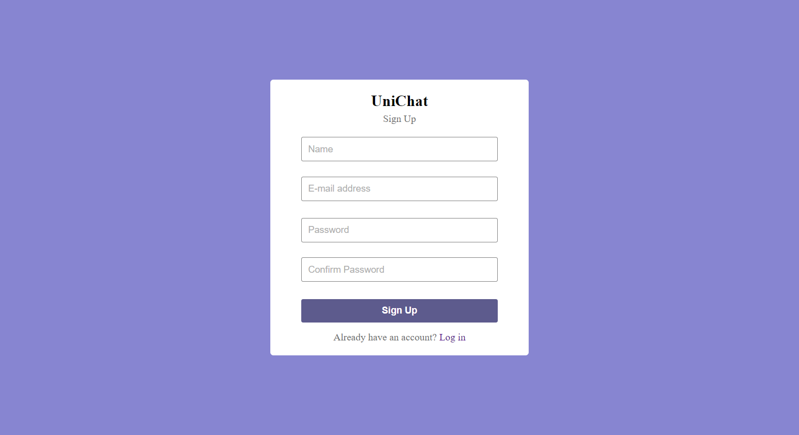

# Real-Time Chat Application
A real-time chat application where users can create accounts and engage in one-on-one conversations. The application is built using **HTML, CSS, JavaScript, PHP**, and **MySQL**.

## Features

- **User Authentication**: Users can sign up, log in, and securely manage their accounts.
- **Real-Time Messaging**: Users can send and receive messages in real-time.
- **Message Storage**: All conversations are stored in a database and can be retrieved later.
- **Update profile**: A user can update his profile picture, name, and password.
<!-- - **Responsive Design**: The application is fully responsive and works seamlessly on different devices. -->

## Technologies Used

- **Frontend**: HTML, CSS, JavaScript
- **Backend**: PHP
- **Database**: MySQL

## Results of the Project

The Real-Time Chat Application successfully enables users to create accounts, log in, and engage in one-on-one real-time conversations. Below are screenshots showcasing the application’s key features:

### Sign Up Page

<p align="center">
   
</p>


### Login Page

<p align="center">
   
</p>

### Chat Interfaces
<p align="center"> <b>Home Page</b></p>
<p align="center">   
   
</p>
<br>
<p align="center"> <b>Conversation Page</b></p>
<p align="center">
   
</p>
<br>
<p align="center"> <b>Search a User</b></p>
<p align="center">
   
</p>

## Getting Started

### Prerequisites

To run this application, you'll need the following installed on your system:

- [XAMPP](https://www.apachefriends.org/index.html) or any LAMP/WAMP/MAMP server with PHP and MySQL support.
- A modern web browser for accessing the web application.

### Installation

1. **Clone the repository**:  Clone this repository into your `htdocs` folder.
   ```bash
   git clone https://github.com/nazmulhossin/real-time-chat-application.git
   cd real-time-chat-app
2. **Set up the database**:
   - Start Apache and MySQL services in XAMPP (or your chosen server software).
   - Open phpMyAdmin (URL: `http://localhost/phpmyadmin`)
   - Create a new database called `unichat`.
   - Import the SQL file located in the `/database/unichat.sql` folder to set up the necessary tables.

4. **Run the application**:
   - Open a web browser and navigate to: `http://localhost/real-time-chat-application/`

**Notes**
- Ensure that Apache and MySQL are running before accessing the application.
- If you're using a port other than the default 80, modify the URL accordingly (e.g., `http://localhost:8080/real-time-chat-application/`).

